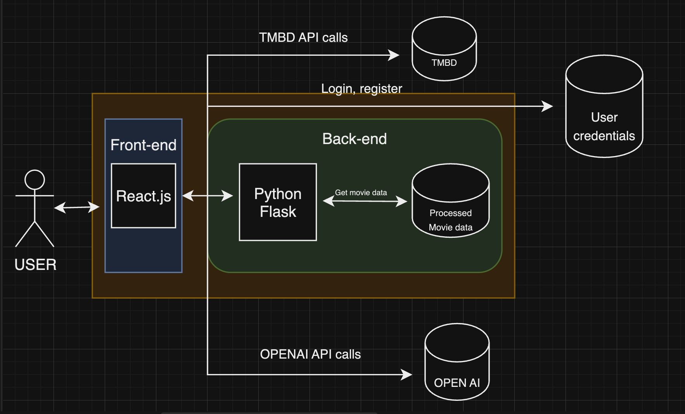

# Movie Recommendation App using Chatbot 
       
## Overview  📋
1. This is a movie recommender app with the help of a chatbot.
2. It enables user to search and go through various details of movies like cast, genre, trailer of movies with the help of an API by TMBD.
3. The user can also get recommendations based on the movie they have liked or disliked using the chatbot.
4. The Chatbot can also give you the summary of the movie.

## Installation 📦
1. Clone or download this repository to your local machine.
2.  Install all the libraries mentioned in the [requirements.txt] 
    ```shell
    $ pip install -r requirements.txt
    ```
 3. Then run the flask server by 
    ```shell
    $ python app.py
    ```
4. Go to the movie-recommender-app directory and install the node modules and build the project.
    ```shell
    $ cd movie-recommender-app
    $ npm install
    ```
5. Go to the package.json file and change the proxy to your flask server local port which is most likely localhost:5000
6. Then build the project by
    ```shell
    $ npm run build
    ```
7. To the local flask server to start the project
    > localhost :portNumber
    
9. **If this doesn't work** use 
    ```shell
    $ npm start
    ```
 
 ## Architecture 



 ## References 
 1. TMDB's API : https://www.themoviedb.org/documentation/api
 2. OpenAI API : https://platform.openai.com/docs/api-reference
